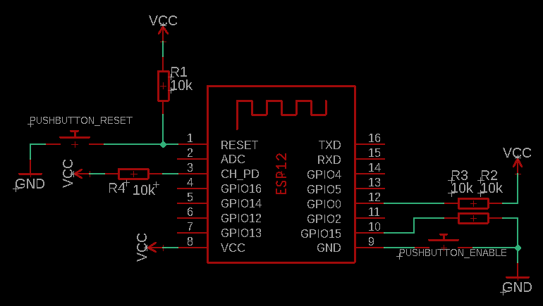

# smart-mailbox

Make your Mailbox smart with an ESP12-E/F, two buttons and MQTT.

## Parts

- ESP12E or ESP12F
- 4x 10k Resistors
- 2x [Limit Switches](https://octopart.com/ss-5gl-omron-3346)
- Battery or other power supply

## Schematic

## Installation

- For the front (Postman) hatch place the Reset-Button (Normally-Open-Button, NO-Button)
in a way that the button is pushed while the hatch is open

- For the rear hatch place the Enable-Button (Normally-Open-Button, NO-Button)
in a way that the button is pushed while the hatch is closed
